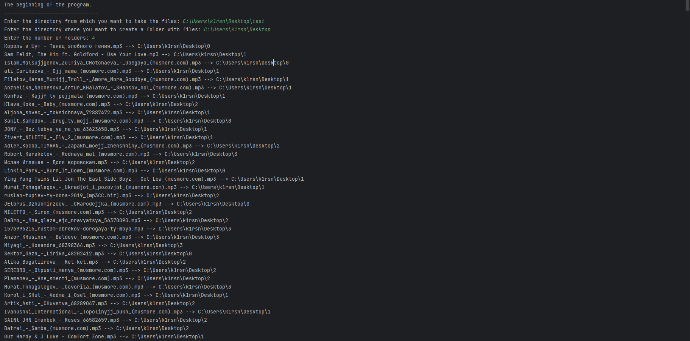
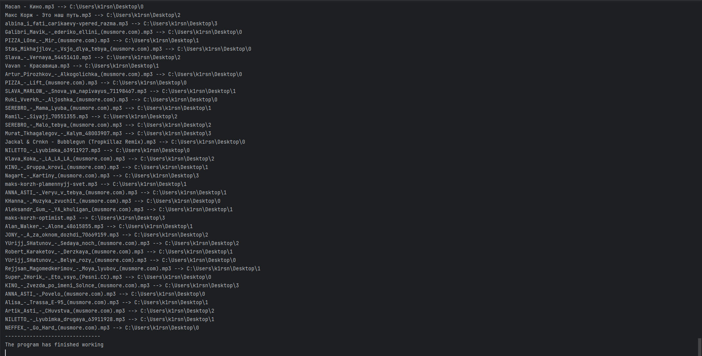

  
	
	

  <h2>Idea about the program</h2>

<a>
  Most cars have a multimedia system. My car was no exception. The plan was to download songs to a USB stick. I downloaded 770 tracks. The trouble was that the multimedia system saw only 255 tracks. The problem is that the length of the string consists of ASCI characters. The only way around this problem is to organize the 770 tracks into folders so that each folder contains no more than 255 tracks. It would seem that you could just use CTRL+C CTRL+V. The problem with this method is that it can be classified as an O^2 "slow algorithm". And if you also randomize, this method can be classified as "very slow algorithms" O! (Reference the book <a href="https://en.ecomed.dgmu.ru/wp-content/uploads/2020/01/%D0%93%D1%80%D0%BE%D0%BA%D0%B0%D0%B5%D0%BC_%D0%B0%D0%BB%D0%B3%D0%BE%D1%80%D0%B8%D1%82%D0%BC%D1%8B.pdf">"Grokking Algorithms" by Aditya Bhargava</a>). As you can understand this is a burning issue for many car enthusiasts. To save myself and others time in the future it was decided to develop a console application in Python. It took less than an hour to write the code and the help from it is tremendous.
</a>

  <h2>About  the program</h2>

<a>
  
  The program involves three fields with data entry: 
* In the first field, the user is asked to enter the path to the folder containing the tracks to be distributed into mini folders.
* In the second field, the user is asked to enter the path to the folder where the program will create mini folders.
* The third field asks the user for the number of mini folders. 

After correct input of data users the program starts its work. The first thing the program does is create mini folders. They are named with numbers from 0 to the number entered by the user. After that the program gets the list of files in the folder with tracks. Then by randomly selecting a file its new random location is determined. After the program detects and checks if the limit in the new mini track folder is exceeded, the track is moved. After the program starts to do the same with the new file until it runs out of files. 

Disadvantages of the program: 
* The program allocates to mini folders all files within a folder without exception. (But this is not a problem if the user places all tracks in a new folder beforehand)
* Problems with the program appear if the user tries to create mini folders inside the folder from which he takes tracks.
</a>

  <h2>How do I start the program? </h2>

<a>
  
  There are two ways you can run the program: 
* Download and run the <a href="https://github.com/K1rsN7/music_distribution_for_cars/blob/main/random_file.exe">*"random_file.exe "*</a> file on your computer. 
* Open the file <a href="https://github.com/K1rsN7/music_distribution_for_cars/blob/main/random_file.py">*"random_file.py "*</a> in an IDE supporting the Python language. 

The program was made under the Windows operating system
</a>

  <h2>Example  of program operation</h2>
  
  
  
  

